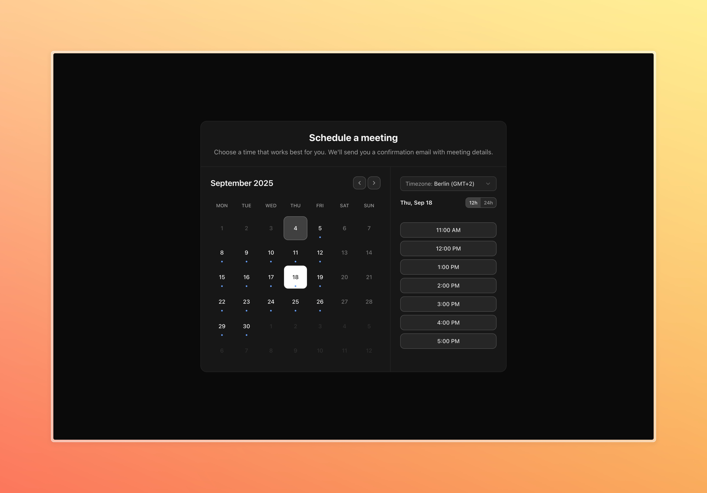
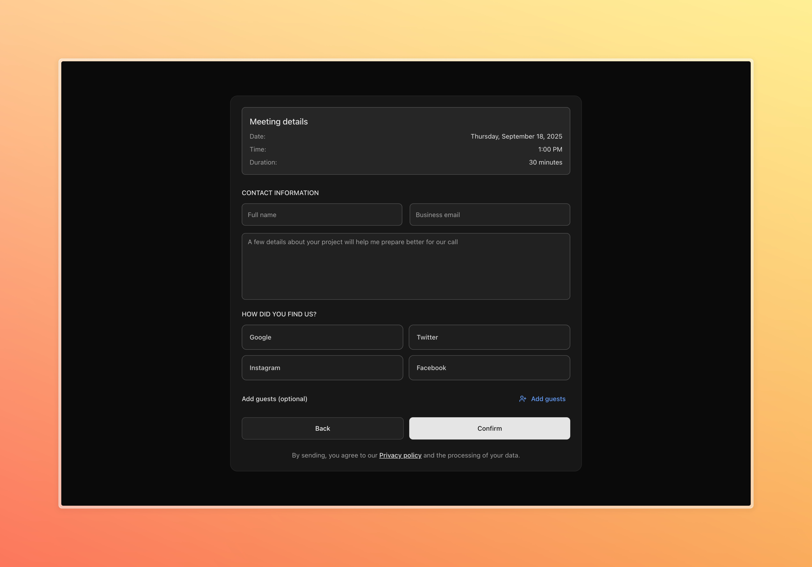
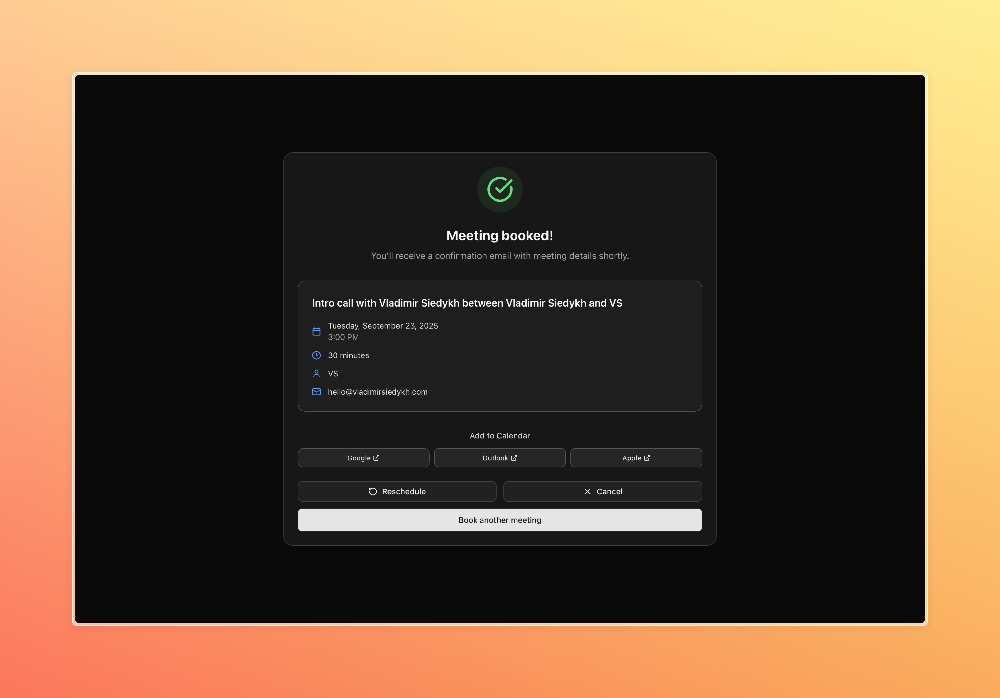

# BookingCalendar 📅

Beautiful, fast, and customizable booking calendar UI for Next.js with Cal.com v2 integration. Built for real-world use (from my site), open-sourced so you can copy, paste, and ship.


[](https://vladimirsiedykh.com/contact)

## Live Preview

- Live on my site: https://vladimirsiedykh.com/contact

## Screenshots





## ✨ Features

- 🎨 Beautiful UI: Modern, accessible, responsive.
- 🌍 Timezone-aware: Auto-detection + manual selector.
- ⏰ 12h/24h formats: User-toggle in UI.
- 🔌 Cal.com v2: Slots, Bookings, Reschedule, Cancel.
- ⚡ Fast UX: Prefetch + intersection observer.
- 📦 Copy-paste ready: No package install required.

## Tech Stack

- Tailwind CSS (v4) for styles
- shadcn/ui components (copied into `src/components/ui`)
- React + Next.js (App Router)
- TypeScript throughout
- Radix primitives under the hood via the shadcn components

## Performance

- Prefetch: As the widget nears the viewport, it prefetches the whole visible month’s available slots so switching days feels instant.
- Intersection Observer: Uses the browser’s `IntersectionObserver` with a `rootMargin` of ~500px to start work before the user sees the calendar.
- Local Filtering: Clicking a day filters prefetched data locally; it only calls the API again if that specific day wasn’t covered or needs refresh.
- Smooth UX: Slot list shows skeletons during loading; the widget auto‑scrolls on step changes (calendar ↔ form ↔ success) to keep context.
- No Setup Needed: This all runs automatically — just render `BookingWidget` and configure your event type and API routes.

## What You Copy

Copy these folders into your Next.js app:

- `src/components/booking-calendar` (the calendar UI)
- `src/lib/booking-calendar` (hooks + utils)
- `src/components/ui` primitives used by the calendar:
  - `button.tsx`, `input.tsx`, `textarea.tsx`, `select.tsx`, `label.tsx`, `alert-dialog.tsx`, `alert.tsx`

Also ensure Tailwind is set up (Tailwind v4 config example is in this repo under `src/app/globals.css`).

## Install Dependencies

```bash
pnpm add @radix-ui/react-select @radix-ui/react-slot @radix-ui/react-label
pnpm add class-variance-authority clsx tailwind-merge
pnpm add react-day-picker react-hook-form @hookform/resolvers zod
pnpm add lucide-react
```

## Environment Variables

Add to your `.env.local` in your app:

```env
CALCOM_API_KEY=your_cal_com_api_key_here
CALCOM_API_URL=https://api.cal.com/v2

NEXT_PUBLIC_CALCOM_EVENT_TYPE_ID=your_event_type_id_here
```

Note: Only `NEXT_PUBLIC_*` values are exposed to the client. Keep `CALCOM_API_KEY` server-side.

This repo includes `.env.example` — copy it to `.env.local` and fill in your values:

```bash
cp .env.example .env.local
```

## API Routes (Add to your app)

Create these files (or copy from `src/app/api/booking-calendar/*`):

1) `app/api/booking-calendar/slots/route.ts`
- Proxies to Cal.com v2 `/slots` using `start` and `end` ISO params and returns the `data` object keyed by date.

2) `app/api/booking-calendar/book/route.ts`
- Validates input, converts `eventTypeId` to number, sends `bookingFieldsResponses`, and POSTs to Cal.com v2 `/bookings`.

3) `app/api/booking-calendar/reschedule/route.ts`
- POST to `/bookings/{uid}/reschedule` with the new `start`.

4) `app/api/booking-calendar/cancel/route.ts`
- POST to `/bookings/{uid}/cancel` with an optional reason.

This repo leaves a lightweight `applyRateLimit` stub; you can keep it as-is or add your own (Cal.com has its own rate limits, so external rate-limiting is optional).

## Use the Component

In your page or component:

```tsx
import BookingWidget from '@/components/booking-calendar/booking-widget';

export default function Contact() {
  return (
    <div className="max-w-3xl mx-auto p-4">
      <BookingWidget
        eventTypeId={process.env.NEXT_PUBLIC_CALCOM_EVENT_TYPE_ID || ''}
        eventLength={30}
        title="Schedule a meeting"
        description="Choose a time that works best for you. We'll send you a confirmation email with meeting details."
        showHeader
      />
    </div>
  );
}
```

The widget provides:

- Calendar with available days (markers from prefetched month slots)
- Time slots panel with timezone + 12h/24h toggle
- Booking form with validation, guests, and optional referral source
- Success view with “Add to Calendar”, and in-session reschedule/cancel — users can immediately reschedule or cancel without leaving the page

## Notes on Cal.com Versions

The API routes include `cal-api-version` headers. This repo uses the versions you see in code (e.g., `2024-08-13` for bookings). If you update versions, check Cal.com v2 docs first and test against your account.

## Local Development

```bash
pnpm install
pnpm dev
# visit http://localhost:3000
```

Ensure you have `.env.local` set as above before running.

## Contributing

PRs welcome! If you see UX improvements, accessibility tweaks, or gaps in docs, please open an issue or PR.

## License

MIT — see [LICENSE](LICENSE).

This project is unaffiliated with Cal.com. “Cal.com” and related marks are trademarks of their respective owners. Use the Cal.com API in accordance with their Terms. If you want to be extra safe, skim Cal.com’s API Terms before going live. Keep your API key server-side.

## Credits

- [Cal.com](https://cal.com)
- [shadcn/ui](https://ui.shadcn.com)
- [Lucide](https://lucide.dev)
- [Tailwind CSS](https://tailwindcss.com)

If you have any questions or need help with implementation:

- 🐛 [Report Issues](https://github.com/vladimir-siedykh/booking-calendar/issues)
- 💬 [Discussions](https://github.com/vladimir-siedykh/booking-calendar/discussions)
- 🌐 [Website](https://vladimirsiedykh.com)

---

Built with ❤️ by [Vladimir Siedykh](https://vladimirsiedykh.com)
